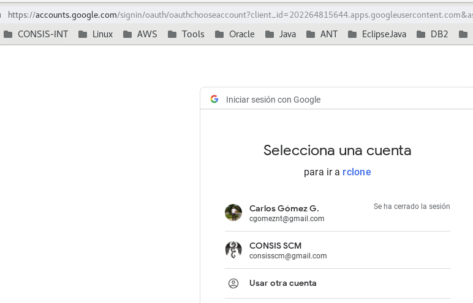
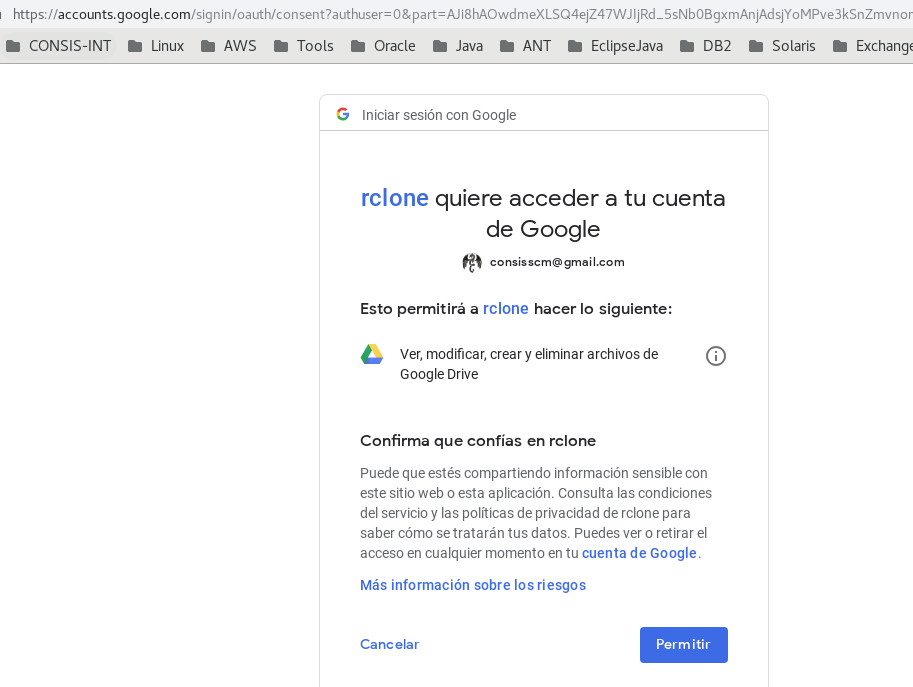
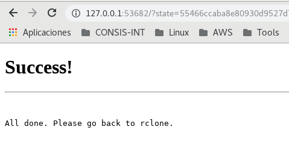

Instalar y configurar rclone
=======================

Pagina oficial:

https://rclone.org/

Desde aquí lo puede instalar y seguir los pasos de instalación:

https://rclone.org/downloads/

Descargamos el comprimido que tiene el binario::

	cd /tmp
	curl -O https://downloads.rclone.org/rclone-current-linux-amd64.zip
	unzip rclone-current-linux-amd64.zip
	cd rclone-*-linux-amd64

Copiamos el binario en el directorio correspondient :

	cp rclone /usr/bin/
	chown root:root /usr/bin/rclone
	chmod 755 /usr/bin/rclone

Ahora instalamos el man de rclone::

	mkdir -p /usr/local/share/man/man1sudo
	cp rclone.1 /usr/local/share/man/man1/
	mandb

Configurando rclone
+++++++++++++++++++++++++

rclone se puede configurar para sincronicar con diferentes servicios, pero en este caso lo vamos a sincronizar con Google Drive. Si requiere de mayor ayuda::

	rclone help

Iniciemos la configuración de rclone contra el servicio de Google Drive::

	$ rclone config
	No remotes found - make a new one
	n) New remote
	s) Set configuration password
	q) Quit config
	n/s/q> n
	name> gdrive
	Type of storage to configure.
	Enter a string value. Press Enter for the default ("").
	Choose a number from below, or type in your own value
	 1 / A stackable unification remote, which can appear to merge the contents of several remotes
	   \ "union"
	 2 / Alias for a existing remote
	   \ "alias"
	 3 / Amazon Drive
	   \ "amazon cloud drive"
	 4 / Amazon S3 Compliant Storage Provider (AWS, Alibaba, Ceph, Digital Ocean, Dreamhost, IBM COS, Minio, etc)
	   \ "s3"
	 5 / Backblaze B2
	   \ "b2"
	 6 / Box
	   \ "box"
	 7 / Cache a remote
	   \ "cache"
	 8 / Dropbox
	   \ "dropbox"
	 9 / Encrypt/Decrypt a remote
	   \ "crypt"
	10 / FTP Connection
	   \ "ftp"
	11 / Google Cloud Storage (this is not Google Drive)
	   \ "google cloud storage"
	12 / Google Drive
	   \ "drive"
	13 / Hubic
	   \ "hubic"
	14 / JottaCloud
	   \ "jottacloud"
	15 / Local Disk
	   \ "local"
	16 / Mega
	   \ "mega"
	17 / Microsoft Azure Blob Storage
	   \ "azureblob"
	18 / Microsoft OneDrive
	   \ "onedrive"
	19 / OpenDrive
	   \ "opendrive"
	20 / Openstack Swift (Rackspace Cloud Files, Memset Memstore, OVH)
	   \ "swift"
	21 / Pcloud
	   \ "pcloud"
	22 / QingCloud Object Storage
	   \ "qingstor"
	23 / SSH/SFTP Connection
	   \ "sftp"
	24 / Webdav
	   \ "webdav"
	25 / Yandex Disk
	   \ "yandex"
	26 / http Connection
	   \ "http"
	Storage> 12
	** See help for drive backend at: https://rclone.org/drive/ **

	Google Application Client Id
	Leave blank normally.
	Enter a string value. Press Enter for the default ("").
	client_id> 
	Google Application Client Secret
	Leave blank normally.
	Enter a string value. Press Enter for the default ("").
	client_secret> 
	Scope that rclone should use when requesting access from drive.
	Enter a string value. Press Enter for the default ("").
	Choose a number from below, or type in your own value
	 1 / Full access all files, excluding Application Data Folder.
	   \ "drive"
	 2 / Read-only access to file metadata and file contents.
	   \ "drive.readonly"
	   / Access to files created by rclone only.
	 3 | These are visible in the drive website.
	   | File authorization is revoked when the user deauthorizes the app.
	   \ "drive.file"
	   / Allows read and write access to the Application Data folder.
	 4 | This is not visible in the drive website.
	   \ "drive.appfolder"
	   / Allows read-only access to file metadata but
	 5 | does not allow any access to read or download file content.
	   \ "drive.metadata.readonly"
	scope> 1
	ID of the root folder
	Leave blank normally.
	Fill in to access "Computers" folders. (see docs).
	Enter a string value. Press Enter for the default ("").
	root_folder_id> 
	Service Account Credentials JSON file path 
	Leave blank normally.
	Needed only if you want use SA instead of interactive login.
	Enter a string value. Press Enter for the default ("").
	service_account_file> 
	Edit advanced config? (y/n)
	y) Yes
	n) No
	y/n> n
	Remote config
	Use auto config?
	 * Say Y if not sure
	 * Say N if you are working on a remote or headless machine
	y) Yes
	n) No
	y/n> y
	If your browser doesn't open automatically go to the following link: http://127.0.0.1:53682/auth
	Log in and authorize rclone for access
	Waiting for code...

En este punto nos abre un navegador y nos lleva hasta la cuenta que necesitamos tener administración del Google Drive, debemos seleccionar la cuenta 

y continua el proceso de configuración en el bash.::

	Got code
	Configure this as a team drive?
	y) Yes
	n) No
	y/n> n
	--------------------
	[gdrive]
	type = drive
	scope = drive
	token = {"access_token":"ya29.Glu7BnYBCF285I4K85idTuScMJG1iQIS6H4dM4nuqhtK_Dv6LDKaamgx1t-e1hMf8lE8o_3iNXbS8nl9N1NCbUHjhDgX3CbTBT721hZOcEqM6lE0ToUafn5W-ov3","token_type":"Bearer","refresh_token":"1/LQBGmFN_dJ-yz-xOhl1jJsegiLxrJ1tSRSauOoGm6fw","expiry":"2019-02-25T12:28:34.56655723-04:00"}
	--------------------
	y) Yes this is OK
	e) Edit this remote
	d) Delete this remote
	y/e/d> y
	Current remotes:

	Name                 Type
	====                 ====
	gdrive               drive

	e) Edit existing remote
	n) New remote
	d) Delete remote
	r) Rename remote
	c) Copy remote
	s) Set configuration password
	q) Quit config
	e/n/d/r/c/s/q> q

